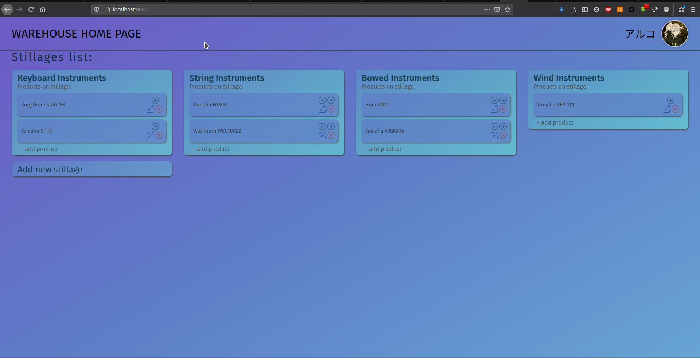

# Домашнее задание по курсу "Технологии Интернет" РК6
## Веб-приложение "Личный кабинет заведующего складом"
Выполнил: **Косенков Александр**, студент группы **РК6-74Б**

## ТЗ
**Склад** - Основной экран: личный кабинет заведующего складом. Кнопка "добавить стеллаж". Список стеллажей с товарами 
(при добавлении вводим назначение стеллажа). Каждый стеллаж - список товаров, которые в нем лежат, кнопка 
"положить товар". При добавлении товара вводим название товара. Товары можно перемещать между стеллажами, 
редактировать их название, удалять.

## Команды для запуска

- `npm start` - запуск webpack-development сервера по адресу `localhost:8000`
- `npm run server` - запуск сервера NodeJS по адресу `localhost:8888`
